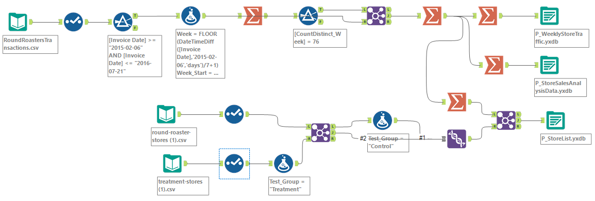

# AB-Testing-and-Predictive-Analysis-for-New-Menu-Launch-using-Alteryx

The coffee restaurant would like to conduct a market test with a new menu and needs to figure whether the new menu can drive enough sales to offset the cost of marketing the new menu.
To minimize the risk, the management team decides to test the changes in two cities with new television advertising. Denver and Chicago were chosen to participate in this test because the stores in these two cities perform similarly to all stores across the entire chain of stores; performance in these two markets would be a good proxy to predict how well the updated menu performs.
The predicted impact to profitability should be enough to justify the increased marketing budget: at least 18% increase in profit growth compared to the comparative period while compared to the control stores; otherwise known as incremental lift.

## Basic Analysis Planning:

### Performance Metric for evaluating the result of A/B test: Gross margin

### Test Period: 4/29/2016 – 7/21/2016 (12 weeks)

### Agrregation Level: Weekly

## Data Cleaning Process:

To Clean missing, incomplete, duplicate, or dirty data. Use these three raw data files to create three files used for A/B Analysis.These files are:

1. Weekly store traffic data for A/B Trend Tool: Produces our seasonality and trends indices to help us match our treatment and control stores
2. Store list data for A/B Controls tool: Produces which control stores to match with our treatment stores along with results from the A/B Trends Tool
3. Store sales analysis data for A/B Analysis tool: Produces the final results

## Match and Treatment Control units:

Creation of trends and seasonality variables, and use them along with other control variable(s) to match two control units to each treatment unit. 
_Note: Calculation done on the number of transactions per store per week to calculate trend and seasonality._

### Control Variables to be considered: AvgMonthSales and Sq_Ft

### Correlation between your each potential control variable and your performance metric: Pearson Correlation Analysis tool

### Control variables will used to match treatment and control stores: AvgMonthSales is statistically significant because the p-value < 0.05.

## Data Analysis and writeup:

### Should the company roll out the updated menu to all stores? 

The company should roll out the updated menu to all stores. Based on the project details, the predicted impact to profitability should be enough to justify the increased marketing budget: at least 18% increase in profit growth compared to the comparative period while compared to the control stores. If we look at the result of average lift (see details in the next two sections) for each region and overall, they are all higher than 18%. Therefore, the company should roll out the updated menu.

### What is the lift from the new menu for West and Central regions (include statistical significance)? 

**West region:** the Average Lift is 37.9% and the Significance Level is 99.5%. See the A/B Test analysis model and report below:

**Central region:** the Average Lift is 43.5% and the Significance Level is 99.5%. See the A/B Test analysis report below:

### What is the lift from the new menu overall?

The lift from the new menu overall is 40.7%. Please see the A/B Test analysis workflow and report below:

